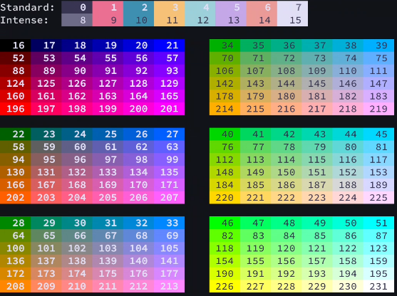

# Xed-Editor Theme Template

This is a theme template for [Xed-Editor](https://github.com/Xed-Editor/Xed-Editor), allowing you to create custom light and dark color schemes for the application, editor and terminal.
You can use this template as a starting point to build your own themes.

## How to get started

1. Download the `theme.json` file from this repository
2. Open the `theme.json` file in a text editor (e.g., Xed-Editor)
3. Modify the theme to your liking
4. Go to **Xed-Editor → Settings → Themes → Add theme**
5. Select your `theme.json` file to apply the theme

See the [API Reference](#api-reference) section for details on available properties.

## Basic Structure

```json
{
    "id": "unique-theme-id",
    "name": "Theme Name",
    "targetVersion": 75,
    "inheritBase": true,
    "light": {},
    "dark": {}
}
```

## Top-Level Properties

| Property        | Type    | Required             | Description                                                           |
| --------------- | ------- | -------------------- | --------------------------------------------------------------------- |
| `id`            | string  | Yes                  | Unique identifier for the theme                                       |
| `name`          | string  | Yes                  | Display name for the theme                                            |
| `targetVersion` | integer | Yes                  | Target version of Xed-Editor                                          |
| `inheritBase`   | boolean | No (default: _true_) | Whether to [inherit](#base-inheritance) `tokenColors` from base theme |
| `light`         | object  | No                   | [Color palette](#color-palettes) for light mode                       |
| `dark`          | object  | No                   | [Color palette](#color-palettes) for dark mode                        |

You can omit optional fields. If a field is missing, the base theme's value will be used as a fallback. This applies to all colors in the theme file except for `tokenColors` if `inheritBase` is set to `false` ([Base inheritance](#base-inheritance)).

> [!NOTE]
> All properties in the `theme.json` file are case-sensitive. Make sure to use the correct casing when defining properties.

> [!NOTE]
> The base theme is the default Xed-Editor theme that ships with the application, it's called `blueberry`.

## Base Inheritance

If `inheritBase` is set to `true`, the theme will inherit the `tokenColors` from the base theme if they are not defined in the custom theme.
That means all properties defined in the custom theme will override the base theme's properties, while any missing properties will fall back to the base theme's values. If `inheritBase` is set to `false`, the theme will only use the properties defined in the custom theme. This means any missing syntax element colors will not have a fallback so they will not be distinguishable from other syntax elements.

## Color Palettes

Each of the `light` and `dark` objects can contain the following color categories:

| Category         | Type            | Description                                 |
| ---------------- | --------------- | ------------------------------------------- |
| `baseColors`     | object          | Colors for the user interface of the app    |
| `editorColors`   | object          | Colors for the user interface of the editor |
| `terminalColors` | object          | Colors for the integrated terminal          |
| `tokenColors`    | object \| array | Syntax highlighting colors for the editor   |

You can read more about each category in the [API Reference](#api-reference) section.

## API Reference

This section provides detailed information about each color category and its properties.

### baseColors

Defines colors for the user interface of the application. As Xed-Editor follows the Material You design guidelines, these colors are based on the Material Design color system (https://m3.material.io/styles/color/roles).
The values have to be in the standard Android hex color format (`#RRGGBB` or `#AARRGGBB`). Optionally color names can be used (e.g., `red`, `blue`, etc.).

| Property                  | Type   | Description                                      | Usage example                                |
| ------------------------- | ------ | ------------------------------------------------ | -------------------------------------------- |
| `primary`                 | string | Primary color used in the UI                     | Active tab                                   |
| `onPrimary`               | string | Color used for text/icons on primary color       | _Currently not used_                         |
| `primaryContainer`        | string | Container color for primary color                | Active terminal session background in drawer |
| `onPrimaryContainer`      | string | Color used for text/icons on primary container   | Active terminal session foreground in drawer |
| `secondary`               | string | Secondary color used in the UI                   | File icons in drawer                         |
| `onSecondary`             | string | Color used for text/icons on secondary color     | _Currently not used_                         |
| `secondaryContainer`      | string | Container color for secondary color              | _Currently not used_                         |
| `onSecondaryContainer`    | string | Color used for text/icons on secondary container | _Currently not used_                         |
| `tertiary`                | string | Tertiary color used in the UI                    | _Currently not used_                         |
| `onTertiary`              | string | Color used for text/icons on tertiary color      | _Currently not used_                         |
| `tertiaryContainer`       | string | Container color for tertiary color               | _Currently not used_                         |
| `onTertiaryContainer`     | string | Color used for text/icons on tertiary            | _Currently not used_                         |
| `error`                   | string | Color used for error messages                    | Error message below input field              |
| `onError`                 | string | Color used for text/icons on error color         | _Currently not used_                         |
| `errorContainer`          | string | Container color for error color                  | _Currently not used_                         |
| `onErrorContainer`        | string | Color used for text/icons on error container     | _Currently not used_                         |
| `background`              | string | Background color of the application              | Settings or terminal background              |
| `onBackground`            | string | Color used for text/icons on background          | Settings title                               |
| `surface`                 | string | Surface color for UI elements                    | Toolbar                                      |
| `onSurface`               | string | Color used for text/icons on surface color       | File name in drawer or terminal default text |
| `surfaceVariant`          | string | Variant surface color for UI elements            | Dragged tab background                       |
| `onSurfaceVariant`        | string | Color used for text/icons on surface variant     | Toolbar actions or settings subtitle         |
| `outline`                 | string | Color used for outlines                          | _Currently not used_                         |
| `outlineVariant`          | string | Variant outline color                            | Dividers in editor and settings              |
| `inverseSurface`          | string | Inverse surface color for UI elements            | _Currently not used_                         |
| `inverseOnSurface`        | string | Color used for text/icons on inverse surface     | _Currently not used_                         |
| `inversePrimary`          | string | Inverse primary color used in the UI             | _Currently not used_                         |
| `surfaceTint`             | string | Tint color for surfaces                          | _Currently not used_                         |
| `surfaceDim`              | string | Dimmed surface color for UI elements             | _Currently not used_                         |
| `surfaceBright`           | string | Brightened surface color for UI elements         | _Currently not used_                         |
| `surfaceContainerLowest`  | string | Lowest container surface color                   | _Currently not used_                         |
| `surfaceContainerLow`     | string | Low container surface color                      | _Currently not used_                         |
| `surfaceContainer`        | string | Container surface color                          | Dropdown menu                                |
| `surfaceContainerHigh`    | string | High container surface color                     | _Currently not used_                         |
| `surfaceContainerHighest` | string | Highest container surface color                  | _Currently not used_                         |
| `scrim`                   | string | Color used for scrims                            | _Currently not used_                         |

### editorColors

Defines colors for the user interface of the text editor.
The values have to be in the standard Android hex color format (`#RRGGBB` or `#AARRGGBB`). Optionally color names can be used (e.g., `red`, `blue`, etc.).

| Property                               | Type   | Description                                           |
| -------------------------------------- | ------ | ----------------------------------------------------- |
| `problem_typo`                         | string | Color for text marked as a typo                       |
| `problem_warning`                      | string | Color for warnings in editor                          |
| `problem_error`                        | string | Color for errors in editor                            |
| `sticky_scroll_divider`                | string | Color of sticky scroll divider                        |
| `strikethrough`                        | string | Color for strikethrough text                          |
| ~~`strike_through`~~                   | string | old property for strikethrough (_Deprecated_)         |
| `diagnostic_tooltip_action`            | string | Color of action buttons in diagnostic tooltips        |
| `diagnostic_tooltip_detailed_msg`      | string | Color for detailed messages in diagnostic tooltips    |
| `diagnostic_tooltip_brief_msg`         | string | Color for brief messages in diagnostic tooltips       |
| `diagnostic_tooltip_background`        | string | Background color of diagnostic tooltips               |
| `function_char_background_stroke`      | string | Stroke color for function character background        |
| `hard_wrap_marker`                     | string | Color for hard wrap markers                           |
| `text_inlay_hint_foreground`           | string | Foreground color of inlay hints                       |
| `text_inlay_hint_background`           | string | Background color of inlay hints                       |
| `snippet_background_editing`           | string | Background for editable snippet areas                 |
| `snippet_background_related`           | string | Background for related snippet areas                  |
| `snippet_background_inactive`          | string | Background for inactive snippet areas                 |
| `side_block_line`                      | string | Color of side block lines                             |
| `non_printable_char`                   | string | Color of non-printable characters                     |
| `text_selected`                        | string | Foreground color for selected text                    |
| `matched_text_background`              | string | Background for matched text                           |
| `matched_text_border`                  | string | Border for matched text                               |
| `completion_wnd_corner`                | string | Color of completion window corners                    |
| `completion_wnd_background`            | string | Background color of completion window                 |
| `completion_wnd_text_matched`          | string | Color for matched text in completion window           |
| `completion_wnd_text_primary`          | string | Primary text color in completion window               |
| `completion_wnd_text_secondary`        | string | Secondary text color in completion window             |
| `completion_wnd_item_current`          | string | Background color of current item in completion window |
| ~~`line_block_label`~~                 | string | color for line block label (_Deprecated_)             |
| `text_highlight_strong_background`     | string | Background for strong highlights                      |
| `text_highlight_strong_border`         | string | Border for strong highlights                          |
| `text_highlight_background`            | string | Background for normal highlights                      |
| `text_highlight_border`                | string | Border for normal highlights                          |
| `highlighted_delimiters_background`    | string | Background color for highlighted delimiters           |
| `highlighted_delimiters_underline`     | string | Underline color for highlighted delimiters            |
| `highlighted_delimiters_foreground`    | string | Foreground color for highlighted delimiters           |
| `highlighted_delimiters_border`        | string | Border color for highlighted delimiters               |
| `line_number_panel_text`               | string | Text color for line number panel                      |
| `line_number_panel`                    | string | Background for line number panel                      |
| `block_line_current`                   | string | Color for the current block line                      |
| `block_line`                           | string | Color for non-current block lines                     |
| `scroll_bar_track`                     | string | Color of scroll bar track                             |
| `scroll_bar_thumb_pressed`             | string | Color of pressed scroll bar thumb                     |
| `scroll_bar_thumb`                     | string | Color of scroll bar thumb                             |
| `underline`                            | string | Color for underlined text                             |
| `current_line`                         | string | Background for current line                           |
| `current_row_border`                   | string | Border for current row                                |
| `selection_handle`                     | string | Color of selection handle                             |
| `selection_insert`                     | string | Color for insertion point                             |
| `selected_text_background`             | string | Background for selected text                          |
| `selected_text_border`                 | string | Border for selected text                              |
| `text_normal`                          | string | Default text color                                    |
| `whole_background`                     | string | Background color of editor                            |
| `line_number_background`               | string | Background for line numbers                           |
| `line_number_current`                  | string | Background for current line number                    |
| `line_number`                          | string | Text color for line numbers                           |
| `line_divider`                         | string | Color for line dividers                               |
| `signature_text_normal`                | string | Default color for signature text                      |
| `signature_text_highlighted_parameter` | string | Highlight color for signature parameters              |
| `hover_text_normal`                    | string | Normal text color in hover tooltip                    |
| `hover_text_highlighted`               | string | Highlighted text in hover tooltip                     |
| `hover_background`                     | string | Background of hover tooltip                           |
| `hover_border`                         | string | Border of hover tooltip                               |
| `static_span_background`               | string | Background for static spans                           |
| `static_span_foreground`               | string | Foreground for static spans                           |
| `signature_background`                 | string | Background for signature blocks                       |
| `signature_border`                     | string | Border for signature blocks                           |
| `text_action_window_background`        | string | Background for text action window                     |
| `text_action_window_icon_color`        | string | Icon color for text action window                     |
| ~~`attribute_value`~~                  | string | old property for attribute value (_Deprecated_)       |
| ~~`attribute_name`~~                   | string | old property for attribute name (_Deprecated_)        |
| ~~`html_tag`~~                         | string | old property for HTML tags (_Deprecated_)             |
| ~~`annotation`~~                       | string | old property for annotations (_Deprecated_)           |
| ~~`function_name`~~                    | string | old property for function names (_Deprecated_)        |
| ~~`identifier_name`~~                  | string | old property for identifier names (_Deprecated_)      |
| ~~`identifier_var`~~                   | string | old property for identifier variables (_Deprecated_)  |
| ~~`literal`~~                          | string | old property for literals (_Deprecated_)              |
| ~~`operator`~~                         | string | old property for operators (_Deprecated_)             |
| ~~`comment`~~                          | string | old property for comments (_Deprecated_)              |
| ~~`keyword`~~                          | string | old property for keywords (_Deprecated_)              |

### terminalColors

Defines colors for the integrated terminal.

| Property         | Type   | Description                                           | Usage example             |
| ---------------- | ------ | ----------------------------------------------------- | ------------------------- |
| ~~`foreground`~~ | string | **NOTE:** Please use `baseColors.onSurface` instead.  | _Currently not used_      |
| ~~`background`~~ | string | **NOTE:** Please use `baseColors.background` instead. | _Currently not used_      |
| `cursor`         | string | Color of the terminal cursor                          | Terminal cursor           |
| `color0`         | string | Color for ANSI color 0 (black)                        | ANSI black color          |
| `color1`         | string | Color for ANSI color 1 (red)                          | ANSI red color            |
| `color2`         | string | Color for ANSI color 2 (green)                        | ANSI green color          |
| `color3`         | string | Color for ANSI color 3 (yellow)                       | ANSI yellow color         |
| `color4`         | string | Color for ANSI color 4 (blue)                         | ANSI blue color           |
| `color5`         | string | Color for ANSI color 5 (magenta)                      | ANSI magenta color        |
| `color6`         | string | Color for ANSI color 6 (cyan)                         | ANSI cyan color           |
| `color7`         | string | Color for ANSI color 7 (white)                        | ANSI white color          |
| `color8`         | string | Color for ANSI color 8 (bright black)                 | ANSI bright black color   |
| `color9`         | string | Color for ANSI color 9 (bright red)                   | ANSI bright red color     |
| `color10`        | string | Color for ANSI color 10 (bright green)                | ANSI bright green color   |
| `color11`        | string | Color for ANSI color 11 (bright yellow)               | ANSI bright yellow color  |
| `color12`        | string | Color for ANSI color 12 (bright blue)                 | ANSI bright blue color    |
| `color13`        | string | Color for ANSI color 13 (bright magenta)              | ANSI bright magenta color |
| `color14`        | string | Color for ANSI color 14 (bright cyan)                 | ANSI bright cyan color    |
| `color15`        | string | Color for ANSI color 15 (bright white)                | ANSI bright white color   |
| `color16`        | string | Color for ANSI color 16                               | ANSI extended colors      |
| `color17`        | string | Color for ANSI color 17                               | ANSI extended colors      |
| `color18`        | string | Color for ANSI color 18                               | ANSI extended colors      |
| `color19`        | string | Color for ANSI color 19                               | ANSI extended colors      |
| `color20`        | string | Color for ANSI color 20                               | ANSI extended colors      |
| `color21`        | string | Color for ANSI color 21                               | ANSI extended colors      |

> [!WARNING]
> Terminal colors only support solid colors. The values have to be in the hex color format (`#RRGGBB`).

> [!NOTE]
> Some general colors of the terminal are defined in the `baseColors` category, such as the terminal background.

> [!NOTE]
> Only the standard, intense and some extended ANSI colors can be customized. The customization range is limited to `0-21`. The rest of the ANSI colors will use default values.
> 

### tokenColors

Defines syntax highlighting colors for the text editor. You can either define it as an object (for simple themes) or as an array of rules (for more complex themes).

#### As an Object

When defined as an object, you can specify colors for different syntax elements directly. This option allows you to define a mapping only from syntax elements to their corresponding foreground colors. Example:

```json
"tokenColors": {
  "comment": "#6A9955",
  "string": "#CE9178",
  "keyword": "#569CD6",
  "function": "#DCDCAA"
}
```

The values have to be in the hex color format (`#RRGGBB` or `#RRGGBBAA`). Optionally color names can be used (e.g., `red`, `blue`, etc.).

#### As an Array (TextMate-style)

When defined as an array, you can create more complex rules for syntax highlighting. This option follows the TextMate grammar conventions (https://manual.macromates.com/en/language_grammars). Example:

```json
"tokenColors": [
  {
    "scope": "comment",
    "settings": {
      "foreground": "#6A9955",
      "fontStyle": "italic"
    }
  },
  {
    "scope": "string",
    "settings": {
      "foreground": "#CE9178"
    }
  }
]
```

The `scope` property defines which syntax elements the rule applies to, and the `settings` property contains the color settings for that scope. Colors values have to be in the hex color format (`#RRGGBB` or `#RRGGBBAA`). Optionally color names can be used (e.g., `red`, `blue`, etc.).
